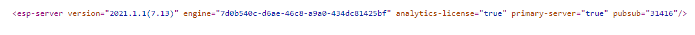
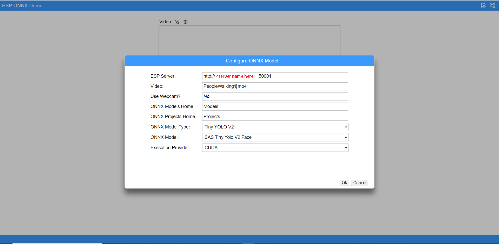

# ONNX runtime ESP integration Samples

## Overview

[Open Neural Network Exchange (ONNX)](https://onnx.ai/) is an open standard format to represent machine learning models. ONNX Runtime is an accelerator for machine learning models with support for multiple platforms and the flexibility to be integrated with a variety of frameworks. This enables developers to approach more complex use cases while maintaining efficient building and testing efforts.

This demo showcases the integration of ONNX Runtime with SAS Event Stream Processing on a Tiny YOLOv2 model, a real-time object detection network. This demo leverages an Intel CPU with (or without, as per user specifications) a CUDA TensorRT CPU on Intel hardware. It is based on a Docker configuration, so having Docker installed is required. The sample UI was developed specifically for this demo with a separate API, [SAS ESP Connect](https://github.com/sassoftware/esp-connect). 

### Content Restrictions
_The images and videos provided with the ESP for ONNX Runtime Samples demo are to be used only with the demo ESP project provided. Using or altering these images or videos beyond the demo for any other purpose is prohibited._

### Prerequisites

To run this demo successfully, the following is required:

Software Requirements:
- Docker version 19.03 or above
- ESP Server running 2021.1.2 or above
- SAS Mirror Manager -- [Install Support](https://support.sas.com/en/documentation/install-center/viya/deployment-tools/4/mirror-manager.html)
- NVIDIA support for Docker (Optional) -- [Installation Guide — NVIDIA Cloud Native Technologies documentation](https://docs.nvidia.com/datacenter/cloud-native/container-toolkit/install-guide.html)

Hardware Requirements:
- To run the example with limited performance, an x86_64 CPU is required.
- To take advantage of the CUDA and TensorRT Execution Providers for acceleration, an NVIDIA graphics card compatible with CUDA 10.2 is required.

Other Considerations:
- This example must be run from a user account in the docker group. To create a docker group and add a user, see the first four steps of [these instructions](https://docs.docker.com/engine/install/linux-postinstall/) or follow the instructions under the Getting Started section below.
- This demo must be run on your local PC, so if you choose to run ESP Docker on a remote server, then you must clone the GitHub repository on your local machine.
- This demo has only been tested on Google Chrome, so it is highly recommended that you use that browser.
- You must be able to connect to the machine the ESP Server is running on. This might require firewall configuration.

### Installation
**Note:** These instructions assume you have downloaded the software license from `my.sas.com`. If you have not, follow [these instructions](https://go.documentation.sas.com/doc/en/espcdc/v_008/dplyedge0phy0lax/p1goagdh3x1uqdn1m1rn57lngpud.htm) first.

1.	Create the following directory and copy the license files into it:
```bash
mkdir -p -m777 ~/ORT-ESPDemo-Home
```
Please ensure that only one license file is present in the directory above and that file extension is `.jwt`.

2.	Download or clone the repository:
```bash
cd ~
git clone https://github.com/sassoftware/iot-sas-esp-onnx-runtime.git
```
3. Run the following command to use SAS Mirror Manager to retrieve the login information for cr.sas.com:
```bash
./mirrormgr list remote docker login --deployment-data _file-name-of-certs.zip_
```
The following information is returned:
```bash
docker login -u ordernumber -p 'password' `cr.sas.com`
```
4. Run the returned command in Docker to log into cr.sas.com.

5. If not already done during Docker Installation, run the following command to manage Docker as a non-root user. *This setting is required to enable use of the scripts*:

   ```bash
   sudo usermod -aG docker $USER
   ```
6.  Log out and log back in so that your group membership is re-evaluated.

## Getting Started

### Running the Script

On the machine where you have Docker installed,
1.	Enter the demo directory: 
```bash
cd ~/iot-sas-esp-onnx-runtime/
```
2. Run the Docker container with the following command to execute the demo:
```bash
./start_esp_server_docker.sh
```
Add the option ‘-G’ to enable the NVIDIA GPU
```bash
./start_esp_server_docker.sh -G
```

These additional options are available:

     Additional options
          -R                          -- Enable Root privileges
          -S                          -- Enable Shell
          -P                          -- Force Pull new image 
          -D                          -- Disable Port publishing
          -h                          -- Show this help

### Starting the Web UI
To test the connectivity with the ESP server, navigate to the following URL from your browser:
```bash
http://<server name here>:50001/eventStreamProcessing/v1/server
```
If the connection succeeds, you should see the following output:


**Note:** the engine is randomly generated, so it will not have the same string as shown.

#### Accessing the UI
1.	Navigate to the directory where you downloaded the scripts, and enter the `/WebUI` folder.
2.	Start up a simple HTTP server through NodeJS or Python:

     a.	For NodeJS, install `http-server npm install –global http-server`. In the WebUI directory, start the server from a port of your choosing using the following command: 
          
     ```bash
     http-server --port 7777
     ```

     b.	For Python, in the WebUI directory, start the server from a port of your choosing using the following command: 
     ```bash
     $ python -m http.server 7777
     ```
3.	Open a browser of your choosing (Google Chrome highly recommended).
4.	Navigate to the following URL with the port you used to start the server:
```bash
http://localhost:7777
```
5.	If you are prompted by the page to allow access to your webcam, then respond affirmatively. You should see this interface:

Ensure that `http://` is in front of the server name. Otherwise, the demo will not work.

6. Confirm your settings by clicking 'OK' and start exploring the demo.

## Contributing

> We welcome your contributions! Please read [CONTRIBUTING.md](CONTRIBUTING.md) for details on how to submit contributions to this project. 

## License

> This project is licensed under the [Apache 2.0 License](LICENSE).

## Additional Resources
* [SAS Event Stream Processing Product Support](https://support.sas.com/en/software/event-stream-processing-support.html)
* [SAS Deep Learning Python (DLPy) Package](https://github.com/sassoftware/python-dlpy)
* [ONNX Runtime Documentation](http://www.onnxruntime.ai/docs/)

